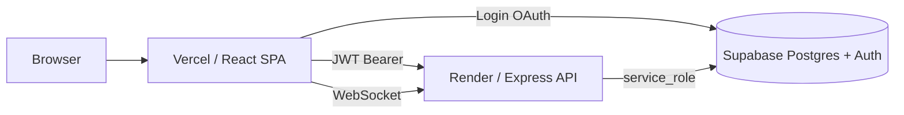

# HEXCloud Production Deployment

Host the **React (Vite) frontend on Vercel** and the **Node.js API on Render**. Supabase remains your database and auth provider.



---

## Prerequisites

1. [Supabase](https://supabase.com) project with schema applied:
   - Run `supabase_setup_all.sql` (or `supabase_schema.sql` + `supabase_billing_admin_migration.sql`)
2. GitHub repo pushed with this monorepo layout (`frontend/`, `backend/`)
3. Accounts on [Vercel](https://vercel.com) and [Render](https://render.com)

---

## Phase 1: Deploy backend on Render

### Option A — Blueprint (`render.yaml`)

1. Render Dashboard → **New** → **Blueprint**
2. Connect the HEXCLOUD repo; Render reads `render.yaml` at the repo root
3. Set secret env vars when prompted (see table below)

### Option B — Manual Web Service

| Setting | Value |
|---------|--------|
| Root Directory | `backend` |
| Build Command | `npm install && npm run build` |
| Start Command | `npm start` |
| Health Check Path | `/health` |

### Backend environment variables (Render)

| Variable | Example / notes |
|----------|-----------------|
| `PORT` | Set automatically by Render |
| `FRONTEND_URL` | `https://your-app.vercel.app` (no trailing slash) |
| `SUPABASE_URL` | `https://xxxx.supabase.co` |
| `SUPABASE_ANON_KEY` | Supabase → Settings → API |
| `SUPABASE_SERVICE_ROLE_KEY` | **Secret** — server only |
| `STRIPE_SECRET_KEY` | Optional |
| `STRIPE_WEBHOOK_SECRET` | Optional |
| `RAZORPAY_KEY_ID` | Optional |
| `RAZORPAY_KEY_SECRET` | Optional |

After deploy, note your API URL, e.g. `https://hexcloud-api.onrender.com`.

Verify:

```bash
curl https://hexcloud-api.onrender.com/health
# {"status":"OK","timestamp":"..."}
```

> **Free tier:** Render spins down after inactivity; first request may take ~30s.

---

## Phase 2: Deploy frontend on Vercel

1. [Vercel Dashboard](https://vercel.com) → **Add New Project** → import HEXCLOUD repo
2. **Root Directory:** `frontend`
3. Framework preset: **Vite** (or use `frontend/vercel.json`)
4. **Environment variables:**

| Key | Value |
|-----|--------|
| `VITE_SUPABASE_URL` | Your Supabase project URL |
| `VITE_SUPABASE_ANON_KEY` | Supabase anon key |
| `VITE_API_URL` | `https://hexcloud-api.onrender.com/api` |
| `VITE_RAZORPAY_KEY_ID` | Optional |
| `VITE_STRIPE_PUBLISHABLE_KEY` | Optional |

5. Deploy. Note production URL, e.g. `https://hexcloud.vercel.app`.

### CLI alternative

```bash
cd frontend
npm install -g vercel
vercel link
vercel env add VITE_SUPABASE_URL
vercel env add VITE_SUPABASE_ANON_KEY
vercel env add VITE_API_URL
vercel --prod
```

`frontend/vercel.json` enables SPA routing (React Router) by rewriting all paths to `index.html`.

---

## Phase 3: Wire Render ↔ Vercel

1. In **Render**, set `FRONTEND_URL` to your Vercel production URL
2. Redeploy the API service (CORS + Socket.io use this origin)
3. Vercel preview URLs (`*.vercel.app`) are allowed automatically

---

## Phase 4: Supabase Auth redirects

Supabase → **Authentication** → **URL Configuration**:

| Type | URL |
|------|-----|
| Site URL | `https://your-app.vercel.app` |
| Redirect URLs | `http://localhost:5173/**` |
| | `https://your-app.vercel.app/**` |
| | `https://*.vercel.app/**` (previews) |

Enable providers (Google, etc.) as needed under **Authentication → Providers**.

---

## Phase 5: Promote admin user

In Supabase **SQL Editor**:

```sql
UPDATE public.users SET role = 'ADMIN' WHERE email = 'your@email.com';
SELECT email, role FROM public.users WHERE email = 'your@email.com';
```

Log out and back in on the Vercel site, then open `/admin`.

---

## Local development

```bash
# From repo root — API + web together
npm install
npm run dev
```

Or separately:

```bash
# Terminal 1
cd backend && cp .env.example .env   # fill keys
npm run dev

# Terminal 2
cd frontend && cp .env.example .env
# VITE_API_URL=http://localhost:5000/api
npm run dev
```

---

## Troubleshooting

| Symptom | Fix |
|---------|-----|
| CORS error in browser | Set `FRONTEND_URL` on Render to exact Vercel URL; redeploy API |
| API 401 / 403 | Log in again; token must be Supabase session JWT |
| Blank page on `/dashboard` refresh | Confirm `vercel.json` rewrites exist |
| Socket disconnects | `VITE_API_URL` must match Render host; check Render logs |
| Tables missing | Re-run `supabase_setup_all.sql` |
| Admin redirect | User `role` must be `ADMIN` in `public.users` |

---

## Architecture notes

- **Frontend:** Auth via Supabase client; data mutations go through the Render API with `Authorization: Bearer <access_token>`.
- **Backend:** Validates JWT with Supabase, uses `SUPABASE_SERVICE_ROLE_KEY` for privileged DB writes.
- **Realtime:** Socket.io on the same Render service as REST.
