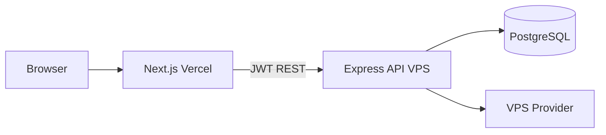

# HEXCloud Architecture

## Monorepo layout

```
HEXCLOUD/
├── apps/web/              # Next.js 14 (Vercel) — dark dashboard, login, admin
├── backend/               # Node.js Express API (VPS deployment)
│   ├── prisma/            # PostgreSQL schema
│   └── src/
│       ├── modules/       # auth, abuse, trial, audit
│       ├── providers/vps/ # Proxmox, Virtualizor, SolusVM, demo
│       ├── routes/v2/     # Production API surface
│       └── jobs/          # Trial expiry cron
├── frontend/              # Legacy Vite SPA (migrate to apps/web)
├── docker/                # Compose + API image
└── docs/
```

## Request flow



## Authentication (v2)

- `POST /api/v2/auth/otp/send` — email OTP
- `POST /api/v2/auth/otp/verify` — returns JWT + session row
- Sessions stored hashed in `sessions` table
- Legacy Supabase JWT still works on `/api/*` routes during migration

## Anti-abuse (trial claim)

Before `POST /api/v2/trial/claim`:

1. Cloudflare Turnstile verification
2. Browser fingerprint (SHA-256 client hash)
3. IP rate limits (express middleware)
4. VPN/proxy/datacenter IP block (ip-api.com heuristic)
5. One trial per fingerprint OR IP (cooldown configurable)

Events logged to `abuse_logs`.

## Trial lifecycle

1. User claims trial → `trials` row `ACTIVE`, wallet credited
2. VPS queued via provider abstraction → `vps_instances`
3. Background job every 60s expires trials past `expiresAt`
4. VPS deleted via provider, status `DELETED`, wallet zeroed

## Admin

- `GET /api/v2/admin/overview`
- Ban users, approve/reject trials
- Audit trail in `audit_logs` + `admin_actions`

## VPS providers

| Provider    | Env `VPS_PROVIDER` | Status   |
|------------|----------------------|----------|
| Demo       | `demo` (default)     | Working  |
| Proxmox    | `proxmox`            | Stub     |
| Virtualizor| `virtualizor`        | Stub     |
| SolusVM    | `solusvm`            | Stub     |

## Security

- Helmet + secure headers
- Zod input validation on v2 routes
- Prisma parameterized queries (SQL injection safe)
- JWT + server-side session revocation support
- CSRF: use SameSite cookies when moving token to httpOnly cookie
- Webhook ingestion with `webhook_events` audit table

## Scalability notes

- Move trial expiry job to Redis queue (BullMQ) at scale
- Add Redis for distributed rate limiting
- Separate worker process for VPS provisioning queue
- Read replicas for PostgreSQL reporting
